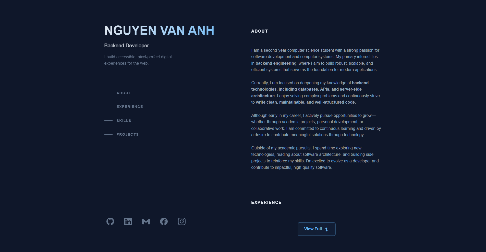

# Portfolio Cá Nhân - Nguyễn Văn Anh



## 📌 Giới Thiệu
Đây là trang portfolio cá nhân của tôi. Portfolio được thiết kế để giới thiệu bản thân, kỹ năng và các dự án đã thực hiện.

## 🎯 Tính Năng Nổi Bật
- **Giao diện hiện đại** với hiệu ứng mượt mà
- **Hoàn toàn responsive** trên mọi thiết bị
- **4 section chính**: Giới thiệu, Kinh nghiệm, Kỹ năng, Dự án
- **Trang archive** liệt kê đầy đủ các dự án
- **Hiệu ứng hover** tương tác đẹp mắt

## 🛠 Công Nghệ Sử Dụng
### Frontend
- **HTML5** - Cấu trúc website
- **CSS3** - Styling và animation
- **JavaScript** - Xử lý tương tác
- **SVG** - Các icon biểu tượng

## 📂 Cấu Trúc Thư Mục

portfolio/
   index.html     
   projects.html      
   assets/
      style.css       
      projects.css   
      responsive.css  
      main.js        
   README.md         
   resume.pdf        


## 🚀 Cách Chạy Dự Án
1. Clone repository:
   ```bash
   git clone https://github.com/VanAnhstudents/VA-Portfolio.git

2. Mở thư mục project:
   cd VA-Portfolio

3. Mở file index.html bằng trình duyệt

## 🌐 Demo Online
[Xem portfolio trực tuyến]()

## 📬 Liên Hệ
- Email: anhnguyenvan280105@gmail.com
- GitHub: [VanAnhstudents](https://github.com/VanAnhstudents)
- Facebook: [Anh Nguyễn Văn](https://www.facebook.com/anhnguyenvan280105)